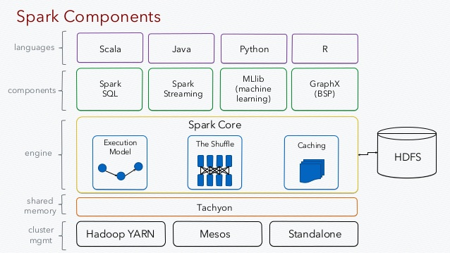

##spark 

full source available at [github](https://github.com/jleetutorial/sparkTutorial)

local[*] explains the number of cores that can be used.
* local[2] = 2 cores
* local[*] = all available cores
* local = 1 core

``SparkConf conf = new SparkConf().setAppName("wordCount").setMaster("local[2]");``

#### RDD
* a capsulation around a very large dataset.
* can contain any type of objects, including user defined
* spark automatically cluster and parallelize data contained in RDD 
* broken into multiple pieces called partitions (automatically)
* IMMUTABLE

#### RDD Workflow
* init RDD 
* transformations (map, filter, etc.)
* actions (count, etc.)

##### Lazy evaluation
Spark only starts loading the data when an action is called.

it's used to reduce number of passes by grouping operations together

##### Create RDD
1. take an existing project and pass it to SparkContext.parallelize method (for test or small sample)
1. load from external storage into SparkContext (S3 or HDFS, [jdbc](https://docs.databricks.com/spark/latest/data-sources/sql-databases.html), [cassandra](http://www.datastax.com/dev/blog/kindling-an-introduction-to-spark-with-cassandra-part-1), [ES](https://www.elastic.co/guide/en/elasticsearch/hadoop/current/spark.html), etc.)

#### Transformation
* **returns results in a new RDD**
* filters invalid rows or getting subset
    * ``JavaRDD<String> cleanedLines = lines.filter(line -> !line.isEmpty());``
* map result of the function being the new value of each element in the resulting RDD    
    *     
            JavaRDD<String> URLs = sc.textFile("");
            URLs.map(url -> makeHttpResuest(url));    
    *
            JavaRDD<String> lines = sc.textFile("");
            JavaRDD<Integer> lengths = lines.map(line -> line.length());
            
##### Flatmap vs map
instead of getting a RDD of lists, we get the RDD of elements in those lists
* map 1 to 1
* flatmap 1 to many

#### Java8 quick references
[javaworld](https://www.javaworld.com/article/2092260/java-se/java-programming-with-lambda-expressions.html)
[oracle](https://www.javaworld.com/article/2092260/java-se/java-programming-with-lambda-expressions.html)

##### Set operation
* Sample
    * creates random sample from RDD
    * useful for testing
    * ``JavaRDD<T> sample(boolean withReplacement, double fraction)``
* Distinct
    * very expensive ! (shuffling)
    * ``JavaRDD<T> distinct()``
* Union
* Intersection
    * very expensive ! (shuffling)    
* Subtract
    * very expensive ! (shuffling)
* Cartesian
    * all possible pairs of A and B

#### Actions    
* **returns results in some other data type**
* collect
    * **entire dataset must fit in memory of the machine !**
* count
* countByValue
* take 
* saveAsTextFile
* reduce    

##### Persist and storage Levels
                
LEVEL     | MEANING
------------|---------------------------
MEMORY_ONLY   | stores RDD as deserialized java objects in JVM. on the fly
MEMORY_AND_DISK   | stores partitions that don't fit on disk and read them from there.
MEMORY_ONLY_SER   | stores RDD as serialized java objects in JVM. space efficient and fast BUT more CPU intensive to read.
MEMORY_AND_DISK_SER   | similar to MEMORY_ONLY_SET and if don't fit in memory stores on disk                
DISK_ONLY   | stores RDD on disk only  
        
Trade-off between memory usage and CPU efficiency
        
1. MEMORY_ONLY
1. MEMORY_ONLY_SER                         
1. MEMORY_AND_DISK_SER                 
1. MEMORY_AND_DISK
1. DISK_ONLY                 
          
######Note: don't save to disk unless the functions that computed your datasets are expensive, ot they filter a significant amount of the data

by calling persist method on RDD you can remove them from cache

##### Spark Architecture
Master (Driver Program) converting spark jobs into tasks for executor worker nodes

#### Pair RDDs
* stores key-value pairs
* contains tuple
* same transformations as normal RDDs
* for key consistency in maps, use **mapValues**
* ReduceByKey runs several reduce operations in parallel

###### Note: for very large datasets reduce is not gonna fit in memory and we'll need reduceByKey
ReduceByKey(**Preferred**) vs GroupByKey
* less shuffling

#### Join (Things to keep in mind before joins)
* distinct or combineByKey before
* generally expensive due to partitioning (shuffled hash join)
* by using HashPartitioner avoid data movement

        HashPartitioner partitioner = new HashPartitioner(20);
        ages.partitionBy(partitioner);
        addresses.partitionBy(partitioner);
        ages.join(addresses);
        
#### Accumulators        
variables that are used for aggregating information across the executors
* Double and Long accumulators 
* Custom accumulator types just by extending [AccumulatorV2](https://spark.apache.org/docs/preview/api/java/org/apache/spark/util/AccumulatorV2.html)

#### Broadcast
a read only variable cached on each machine rather than shipping a copy of it
* broadcast can be any type and gets passed from driver to all workers in spark cluster across wire 
* possible to broadcast custom java objects that are implementing *serializable*
* variables will be sent only once & will be treated as read only
* broadcast value can be accessed by calling the *value* method in each node

#### Spark SQL
* provides dataset and dataframe abstractions
* Dataset
    * strongly-typed API
    * datasets are similar to tables in RDBMS
    * compile time type safety
* Dataframe
    * un-typed API
    * dataframes are DSL for working with un/structured data
    * dataframes stores data in more efficient way than RDD because of their schema
    * dataframes use immutability, in-memory, resilient, distributed and parallel and way more efficient than *Serialization*
    * unlike RDD data is organized in named columns
Spark SQL should be treated like sql connection, so don't forget to close session when done !

Spark SQL uses catalyst optimizer for both spark SQL & DataFrame DSL 
